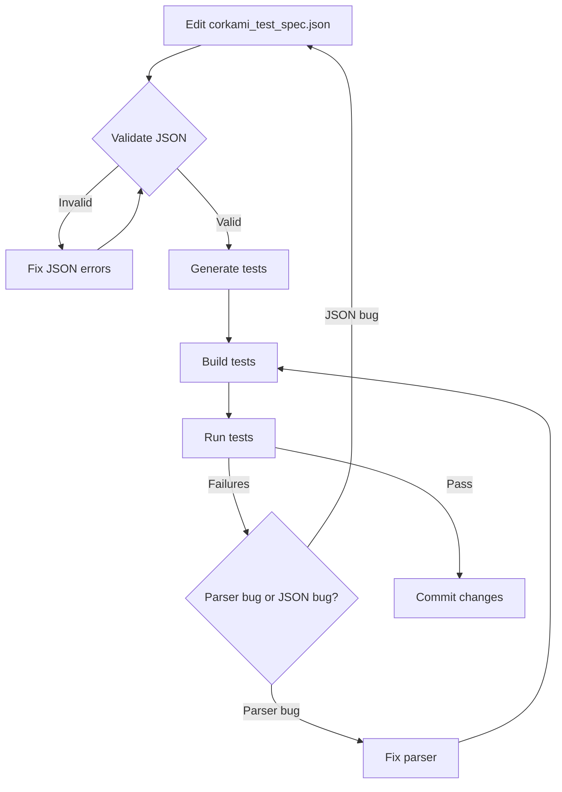

# Corkami PE Test Corpus - JSON-Based Test Specification System

## Overview

This document describes the JSON-based test specification system for validating the mz-explode PE parser against the Corkami PE test corpus. The system enables:

- **Machine-readable** test expectations extracted from Corkami ASM source files
- **Auto-generated** C++ unit tests from JSON specifications
- **Comprehensive coverage** of all PE data directories and fields
- **Easy maintenance** - update JSON instead of editing test code
- **Clear documentation** - JSON serves as both specification and documentation

## Architecture

```
┌─────────────────────────────────┐
│  Corkami ASM Source Files       │
│  (imports.asm, debug.asm, etc)  │
└────────────┬────────────────────┘
             │ (manual analysis)
             ▼
┌─────────────────────────────────┐
│  corkami_test_spec.json         │◄─── JSON Schema Validation
│  (Ground truth expectations)    │     (corkami_test_spec_schema.json)
└────────────┬────────────────────┘
             │
             ▼
┌─────────────────────────────────┐
│  generate_tests_from_json.py    │
│  (Python test generator)        │
└────────────┬────────────────────┘
             │
             ▼
┌─────────────────────────────────┐
│  test_corkami_generated.cpp     │
│  (Auto-generated C++ tests)     │
└────────────┬────────────────────┘
             │
             ▼
┌─────────────────────────────────┐
│  CMake Build & Test Execution   │
└─────────────────────────────────┘
```

## Files

### 1. `corkami_test_spec.json` - Test Specification

**Purpose**: Machine-readable ground truth extracted from Corkami ASM source files

**Structure**:
```json
{
  "title": "Corkami PE Test Corpus Specification",
  "version": "1.0.0",
  "corpus_path": "/path/to/corkami/PE/bin/",
  "test_files": [
    {
      "binary_file": "imports.exe",
      "asm_source": "imports.asm",
      "description": "Standard DLL import test",
      "test_categories": ["import_directory", "basic"],
      "data_directories": {
        "IMPORT": {
          "present": true,
          "dll_count": 2,
          "dlls": [
            {
              "name": "kernel32.dll",
              "function_count": 1,
              "functions": [
                {"name": "ExitProcess", "is_ordinal": false}
              ]
            }
          ]
        }
      }
    }
  ]
}
```

**Coverage**: 20 test files covering all 16 PE data directories

### 2. `corkami_test_spec_schema.json` - JSON Schema

**Purpose**: Validates the structure and types in the test specification

**Usage**:
```bash
# Validate JSON against schema
jsonschema -i corkami_test_spec.json corkami_test_spec_schema.json
```

### 3. `generate_tests_from_json.py` - Test Generator

**Purpose**: Auto-generates C++ doctest test cases from JSON specification

**Usage**:
```bash
# Generate tests
python3 tools/generate_tests_from_json.py

# Output: unittests/test_corkami_generated.cpp
```

**Features**:
- Generates test cases for all data directories
- Case-insensitive string comparisons for DLL/function names
- Handles optional fields (null checks)
- Includes descriptive subcases
- Auto-skips missing files

### 4. `test_corkami_generated.cpp` - Generated Tests

**Purpose**: Auto-generated C++ unit tests (DO NOT EDIT BY HAND)

**Regenerate after changes**:
```bash
python3 tools/generate_tests_from_json.py
cmake --build build
./build/bin/libexe_unittest
```

## Data Directory Coverage

### ✅ Fully Specified

| Directory | Test Files | Fields Validated |
|-----------|-----------|------------------|
| **IMPORT** | imports.exe, imports_mixed.exe, impbyord.exe, debug.exe, tls.exe | DLL count, DLL names, function count, function names, ordinals |
| **EXPORT** | dll.dll, dllord.dll | Module name, export count, export names, ordinals, forwarders |
| **TLS** | tls.exe, tls64.exe, tls_aoi.exe | Callback count, TLS index, address fields |
| **DEBUG** | debug.exe | Entry count, entry type, CodeView signature, GUID, age, PDB path |
| **SECURITY** | signature.exe | Certificate count, type, size, Authenticode flag |
| **COM_DESCRIPTOR** | dotnet20.exe, tinynet.exe | Runtime version, metadata RVA/size, flags |
| **DELAY_IMPORT** | delayimports.exe | DLL count, DLL names, function names |
| **BASERELOC** | ibreloc.exe, dll.dll | Block count, relocation count, types |
| **BOUND_IMPORT** | dllbound.dll | Descriptor count |
| **LOAD_CONFIG** | cfgbogus.exe | Security cookie, CFG flags |

### ⚠️ Partially Specified

| Directory | Status | Notes |
|-----------|--------|-------|
| **RESOURCE** | Present flag only | Complex structure needs detailed schema |
| **EXCEPTION** | Not yet in corpus | 64-bit only, limited test files |
| **IAT** | Covered via IMPORT | IAT is derivative of import directory |
| **GLOBALPTR** | Not in corpus | IA64 only, rare |
| **ARCHITECTURE** | Not in corpus | Reserved (must be zero) |
| **RESERVED** | Not in corpus | Reserved (must be zero) |

## Test Categories

Tests are organized by category for easy filtering:

```json
"test_categories_index": {
  "import_directory": ["imports.exe", "imports_mixed.exe", "impbyord.exe"],
  "export_directory": ["dll.dll", "dllord.dll"],
  "tls_directory": ["tls.exe", "tls64.exe", "tls_aoi.exe"],
  "basic": ["imports.exe", "tls.exe"],
  "edge_case": ["ibreloc.exe", "dllnoreloc.dll"],
  "ordinal_imports": ["imports_mixed.exe", "impbyord.exe"],
  "dotnet": ["dotnet20.exe", "tinynet.exe"],
  "integration": ["compiled.exe"]
}
```

## Field Coverage Index

The JSON includes a `field_coverage` index showing which test files validate which specific fields:

```json
"field_coverage": {
  "import_directory": {
    "dll_count": ["imports.exe", "debug.exe", "tls.exe"],
    "dll_names": ["imports.exe", "imports_mixed.exe"],
    "function_names": ["imports.exe", "debug.exe"],
    "ordinal_imports": ["imports_mixed.exe", "impbyord.exe"]
  },
  "debug_directory": {
    "entry_count": ["debug.exe"],
    "codeview_signature": ["debug.exe"],
    "pdb_path": ["debug.exe"]
  }
}
```

## Adding New Test Files

### Step 1: Analyze ASM Source

```bash
# Read the Corkami ASM file
cat /path/to/corkami/PE/newfile.asm

# Look for:
# - Data directory definitions (IMAGE_DATA_DIRECTORY_16)
# - DLL names and function names
# - Structure sizes and counts
# - Special values (TLS index, debug types, etc.)
```

### Step 2: Add JSON Entry

```json
{
  "binary_file": "newfile.exe",
  "asm_source": "newfile.asm",
  "description": "Tests XYZ feature",
  "test_categories": ["category1", "category2"],
  "data_directories": {
    "IMPORT": {
      "present": true,
      "dll_count": 1,
      "dlls": [
        {
          "name": "kernel32.dll",
          "function_count": 2,
          "functions": [
            {"name": "Function1", "is_ordinal": false},
            {"name": "Function2", "is_ordinal": false}
          ]
        }
      ]
    }
  },
  "pe_header": {
    "imagebase": "0x400000",
    "section_alignment": "0x1000"
  }
}
```

### Step 3: Regenerate Tests

```bash
python3 tools/generate_tests_from_json.py
cmake --build build
./build/bin/libexe_unittest
```

### Step 4: Verify Results

Check that all expected values match:
- DLL counts
- Function names
- Field values
- Structure sizes

## JSON Schema Reference

### Test File Object

```typescript
{
  binary_file: string          // PE file name (e.g., "imports.exe")
  asm_source: string           // ASM source (e.g., "imports.asm")
  description: string          // Human-readable description
  test_categories: string[]    // Categories for filtering
  data_directories?: {         // Optional data directories
    IMPORT?: ImportDirectory
    EXPORT?: ExportDirectory
    TLS?: TLSDirectory
    DEBUG?: DebugDirectory
    SECURITY?: SecurityDirectory
    COM_DESCRIPTOR?: COMDescriptor
    DELAY_IMPORT?: DelayImportDirectory
    BASERELOC?: RelocationDirectory
    BOUND_IMPORT?: BoundImportDirectory
    LOAD_CONFIG?: LoadConfigDirectory
    RESOURCE?: ResourceDirectory
  }
  pe_header?: PEHeader        // Optional PE header checks
}
```

### Import Directory Object

```typescript
{
  present: boolean             // Directory exists
  dll_count?: number          // Expected DLL count
  dlls?: Array<{              // DLL details
    name: string              // DLL name (case-insensitive)
    function_count?: number   // Function count
    functions?: Array<{       // Function details
      name: string | null     // Function name (null for ordinals)
      is_ordinal: boolean     // Import by ordinal?
      ordinal?: number        // Ordinal value
      hint?: number           // Hint value
    }>
  }>
  comment?: string            // Additional notes
}
```

### Debug Directory Object

```typescript
{
  present: boolean            // Directory exists
  entry_count?: number       // Number of debug entries
  entries?: Array<{          // Debug entry details
    type: string             // "CODEVIEW", "MISC", etc.
    type_value?: number      // Numeric type value
    size_of_data?: number    // Data size in bytes
    codeview?: {             // CodeView-specific
      signature: string      // "RSDS", "NB10"
      guid: string          // GUID string
      age: number           // Age value
      pdb_path: string      // PDB file path
    }
  }>
}
```

## Validation Workflow



## Benefits

### 1. **Maintainability**
- Update test expectations by editing JSON
- No need to modify C++ code for new tests
- Clear separation of data and logic

### 2. **Documentation**
- JSON serves as ground truth documentation
- Easy to see what each file tests
- Field coverage index shows test completeness

### 3. **Extensibility**
- Add new test files without touching generator
- Extend schema for new data directory types
- Support for custom validation logic

### 4. **Automation**
- Auto-generate hundreds of test cases
- Consistent test structure
- Reduces manual coding errors

### 5. **Validation**
- JSON schema ensures correct structure
- Type checking prevents typos
- Easy to spot missing fields

## Future Enhancements

### Phase 1: Complete Coverage ✅
- [x] Import directory with ordinals
- [x] Export directory with ordinals
- [x] TLS directory
- [x] Debug directory with CodeView
- [x] Security/Authenticode
- [x] COM descriptor (.NET)
- [x] Delay imports
- [x] Base relocations

### Phase 2: Advanced Validation
- [ ] Export forwarders
- [ ] Bound import timestamps
- [ ] Load config CFG tables
- [ ] Resource directory tree
- [ ] Exception directory (64-bit)
- [ ] Version info resources

### Phase 3: Automation
- [ ] Auto-extract expectations from ASM (parser)
- [ ] Diff tool (expected vs actual)
- [ ] Test coverage reporter
- [ ] CI/CD integration

### Phase 4: Edge Cases
- [ ] Malformed structures
- [ ] Boundary conditions
- [ ] Platform-specific behavior (XP vs W7 vs W10)

## References

- **Corkami PE Corpus**: https://github.com/corkami/pocs/tree/master/PE
- **PE/COFF Specification**: docs/pecoff.docx
- **JSON Schema**: https://json-schema.org/
- **doctest Framework**: https://github.com/doctest/doctest

## Contributing

1. Analyze new Corkami ASM file
2. Add entry to `corkami_test_spec.json`
3. Validate JSON against schema
4. Regenerate tests: `python3 tools/generate_tests_from_json.py`
5. Build and run tests
6. Commit both JSON and generated test file

---

**Generated by**: Claude Code
**Last Updated**: 2024-12-08
**Version**: 1.0.0
